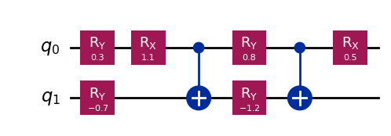

# Background

## Why Quantum Computing?

Almost every area of our lives has changed as a result of modern technology. Classical computers have become an indispensable component of contemporary culture, from smartphones and social media to scientific research and artificial intelligence.

Significant advancements have been made during the last few decades thanks to steadily rising processing power. Even with the most potent supercomputers in the world, some issues are still very challenging.

Think about the challenge of modeling a complicated molecule. The number of potential quantum states increases exponentially with the number of atoms. The computational resources needed eventually grow to the point that traditional computers are unable to carry out the simulation effectively.

Similar difficulties can be seen in other significant fields, such as:

* Drug discovery
* Materials science
* Optimization
* Cryptography
* Machine learning

These limitations motivated researchers to ask a fundamental question:

**Can we build computers that operate according to the laws of quantum mechanics rather than classical physics?**

Quantum computing was developed as a result of this concept.

Quantum computers, in contrast to classical computers, take advantage of special quantum phenomena like entanglement and superposition. These characteristics make it possible for quantum systems to handle information in essentially different ways, and they may offer notable computational advantages for particular problem classes.

Even though they are still in their infancy, quantum computing is one of the most fascinating fields of study in contemporary science and engineering.

---

## What is a Qubit?

To understand how quantum computers work, we must first understand the fundamental unit of quantum information: the **qubit**.

In classical computing, information is stored using bits. A bit can only exist in one of two possible states:

* 0
* 1

For example, every image, video, document, or application stored on your computer is ultimately represented as a long sequence of zeros and ones.

A quantum computer uses a different unit of information called a **quantum bit**, or **qubit**.

Unlike a classical bit, a qubit is not restricted to a single state. Instead, it can exist in a combination of multiple states simultaneously. This unique property allows quantum computers to represent information in a much richer way than classical systems.

The difference between classical bits and qubits is summarized below:

| Classical Bit              | Qubit                                                   |
| -------------------------- | ------------------------------------------------------- |
| Can be 0 or 1              | Can be a combination of 0 and 1                         |
| Based on classical physics | Based on quantum mechanics                              |
| Deterministic              | Probabilistic                                           |
| Stores one state at a time | Can represent multiple possibilities before measurement |

Mathematically, a qubit is represented as:

|ψ⟩ = α|0⟩ + β|1⟩

where:

* α and β are complex numbers called probability amplitudes.
* |0⟩ and |1⟩ are the computational basis states.

The probabilities associated with these states must satisfy:

|α|² + |β|² = 1

This condition ensures that the total probability of all possible measurement outcomes equals one.

At first glance, a qubit may seem like a simple extension of a classical bit. However, when multiple qubits interact, they can exhibit uniquely quantum behaviors that have no classical equivalent. These behaviors form the foundation of quantum computing and enable algorithms that would be impossible to implement efficiently on classical machines.

---

## Superposition

One of the most remarkable features of quantum mechanics is a phenomenon known as **superposition**.

To understand superposition, let us first consider a classical bit.

A classical bit can only occupy one state at a time. At any given moment, it must be either:

* 0
* 1

There is no intermediate possibility.

A qubit, however, behaves differently.

Instead of being restricted to a single state, a qubit can exist in a combination of both states simultaneously. This is known as a **superposition state**.

For example, a qubit may be prepared in the state:

(|0⟩ + |1⟩)/√2

In this state, the qubit is not simply 0 and it is not simply 1. Instead, it contains information about both possibilities simultaneously.

When a measurement is performed, the quantum state collapses and produces one of the two possible outcomes:

* 0 with probability 50%
* 1 with probability 50%

Compared to traditional computing, this behavior is essentially different.

Imagining a spinning coin is a natural approach to conceptualize superposition.

Just as a classical bit is either 0 or 1, a coin on a table is either heads or tails.

But it's not obvious whether the coin is heads or tails while it's spinning. Aspects of both options are present in its current state. This comparison offers a helpful intuition for comprehending superposition, despite its flaws.

One of the primary ways quantum computers can interpret information differently from classical computers is through the creation and manipulation of superposition states.

In many quantum algorithms, qubits are first prepared in superposition states before operations that take advantage of the information stored in those states are carried out.

Unfortunately, superposition is also extremely fragile. Interactions with the environment can destroy these states, causing the quantum system to lose information. This phenomenon is one of the primary sources of noise in quantum computing and motivates the need for error mitigation techniques such as Zero-Noise Extrapolation.

---
## Quantum Gates

In classical computing, computations are performed using logic gates such as AND, OR, and NOT. These gates manipulate classical bits to perform calculations.

Quantum computers also use gates, but instead of acting on bits, they operate on qubits. These operations are known as **quantum gates**.

Quantum gates modify the quantum state of a qubit and are represented mathematically by unitary matrices. By applying sequences of quantum gates, it becomes possible to perform complex quantum computations.

In this project, several quantum gates are used to construct the experimental circuit. Before examining the circuit itself, it is useful to understand the purpose of these gates.

---

### Pauli-X Gate

The Pauli-X gate is often considered the quantum equivalent of the classical NOT gate.

Its action is simple:

|0⟩ → |1⟩

|1⟩ → |0⟩

In other words, it flips the state of the qubit.

This gate is particularly important because Bit-Flip Noise is mathematically modeled using the Pauli-X operator.

---

### Pauli-Z Gate

Unlike the Pauli-X gate, the Pauli-Z gate does not change the measured value of the qubit.

Instead, it changes the phase of the quantum state.

For example:

|0⟩ → |0⟩

|1⟩ → −|1⟩

Although this transformation may appear small, phase information plays a crucial role in many quantum algorithms.

Phase-Flip Noise is modeled using the Pauli-Z operator.

---

### Hadamard Gate

The Hadamard gate is one of the most important gates in quantum computing.

Its primary purpose is to create superposition.

For example:

|0⟩ → (|0⟩ + |1⟩)/√2

After applying a Hadamard gate, the qubit has an equal probability of being measured as 0 or 1.

Many quantum algorithms begin by placing qubits into superposition using Hadamard gates.

---

### Rotation Gates

Unlike Pauli gates, which perform fixed transformations, rotation gates allow continuous control of a qubit's state.

Two important rotation gates are:

* RX(θ)
* RY(θ)

where θ represents a rotation angle.

These gates rotate the quantum state around different axes of the Bloch Sphere.

Rotation gates are particularly useful in variational quantum algorithms because their parameters can be adjusted and optimized during computation.

The experimental circuit used in this project relies heavily on RX and RY gates to generate non-trivial quantum states.

---

### CNOT Gate

The Controlled-NOT (CNOT) gate is one of the most important two-qubit gates in quantum computing.

The gate operates using:

* A control qubit
* A target qubit

The target qubit is flipped only if the control qubit is in state |1⟩.

Unlike single-qubit gates, the CNOT gate can create entanglement between qubits.

Because entanglement is a key resource in quantum computing, the CNOT gate appears in many quantum algorithms and quantum communication protocols.

The circuit used in this project contains two CNOT gates that introduce correlations between the two qubits and make the circuit sensitive to quantum noise.

---

## Entanglement

If superposition is one of the fundamental principles of quantum computing, **entanglement** is often considered its most powerful resource.

Entanglement describes a unique quantum phenomenon in which two or more qubits become correlated in a way that cannot be explained by classical physics.

When qubits are entangled, the state of one qubit becomes directly related to the state of the other, regardless of the distance separating them.

This does not mean that information travels instantaneously between the qubits. Rather, it means that the quantum system must be described as a whole rather than as independent individual qubits.

---

### Why is Entanglement Important?

Many of the advantages offered by quantum computing arise from the ability to create and manipulate entangled states.

Entanglement plays a central role in:

* Quantum algorithms
* Quantum communication
* Quantum cryptography
* Quantum error correction
* Quantum simulation

Without entanglement, many quantum algorithms would lose their computational advantage over classical approaches.

---

### Creating Entanglement

One of the simplest ways to generate entanglement is by combining a Hadamard gate with a CNOT gate.

Consider a two-qubit system initially prepared in the state:

|00⟩

First, a Hadamard gate is applied to the first qubit, creating a superposition:

(|00⟩ + |10⟩)/√2

Next, a CNOT gate is applied.

The resulting state becomes:

(|00⟩ + |11⟩)/√2

This state is known as a **Bell State**, one of the most famous examples of quantum entanglement.

---

### Bell States

Bell states are maximally entangled two-qubit states.

The Bell state

(|00⟩ + |11⟩)/√2

has a remarkable property.

If the first qubit is measured and found to be 0, the second qubit will also be measured as 0.

If the first qubit is measured and found to be 1, the second qubit will also be measured as 1.

The outcomes are perfectly correlated.

These correlations cannot be explained using classical probability alone and are a direct consequence of quantum entanglement.

---

### Entanglement in This Project

The experimental circuit used in this project contains two CNOT gates.

These gates create correlations between the qubits and generate non-trivial quantum states that are sensitive to noise.

As a result, the expectation value measured in the experiments reflects not only the state of individual qubits but also the correlations established between them.

This makes the circuit a suitable testbed for evaluating the effectiveness of Zero-Noise Extrapolation and Richardson Extrapolation techniques.

---
## Quantum Circuits

Just as classical computers execute programs using sequences of logic gates, quantum computers perform computations using **quantum circuits**.

A quantum circuit is a graphical representation of a quantum computation, showing how quantum gates are applied to qubits over time.

In a quantum circuit:

* Horizontal lines represent qubits.
* Boxes represent quantum gates.
* Operations are applied from left to right.
* Measurements are usually performed at the end of the circuit.

A quantum algorithm can therefore be viewed as a sequence of quantum operations designed to transform an initial quantum state into a desired final state.

---

### Classical Circuits vs Quantum Circuits

Although quantum circuits may visually resemble classical logic circuits, there are important differences.

Classical circuits manipulate bits that are always either 0 or 1.

Quantum circuits manipulate qubits that can exist in superposition states and become entangled with one another.

As a result, quantum circuits can perform operations that have no classical equivalent.

---

### Building Quantum Algorithms

Quantum algorithms are typically constructed by combining multiple quantum gates.

For example:

* Hadamard gates create superposition.
* Rotation gates prepare specific quantum states.
* CNOT gates create entanglement.
* Measurements extract classical information from the quantum system.

By carefully arranging these operations, researchers can design circuits for a wide variety of applications, including optimization, machine learning, chemistry, and cryptography.

---

### The Circuit Used in This Project

To evaluate Zero-Noise Extrapolation, a two-qubit variational quantum circuit was constructed.

The circuit contains:

* RX rotation gates
* RY rotation gates
* CNOT gates

These gates generate non-trivial quantum states and create correlations between qubits, making the circuit sensitive to quantum noise.

The circuit was intentionally designed to include both single-qubit and two-qubit operations so that different types of noise could influence the computation.

This makes it an appropriate benchmark for studying Quantum Error Mitigation techniques such as Zero-Noise Extrapolation.

Figure 1: The variational quantum circuit used in the experiments.

---

### Why This Circuit?

A completely trivial circuit would not provide meaningful information about noise and error mitigation.

By introducing multiple parameterized rotations together with entangling gates, the circuit becomes sufficiently complex to exhibit realistic noise effects while remaining small enough to analyze and simulate efficiently.

The expectation values obtained from this circuit are later used to evaluate the effectiveness of Zero-Noise Extrapolation under different noise models.

---

## Why Are Quantum Computers Noisy?

Up to this point, quantum computing may appear extremely powerful. Quantum computers can exploit superposition, entanglement, and quantum interference to perform computations that are difficult for classical systems.

However, there is a major challenge that currently prevents quantum computers from reaching their full potential:

**Quantum noise.**

Unlike classical bits, qubits are extremely fragile. Their quantum states can be disturbed by even the smallest interactions with the surrounding environment.

As a result, maintaining accurate quantum information throughout a computation becomes a significant engineering challenge.

---

### Fragility of Quantum States

A classical bit can remain stored in memory for long periods without significant issues.

A qubit, however, must preserve delicate quantum properties such as superposition and entanglement.

Unfortunately, these properties can easily be destroyed.

Sources of disturbance include:

* Temperature fluctuations
* Electromagnetic interference
* Imperfect control electronics
* Hardware imperfections
* Interactions with surrounding particles

Even when these disturbances are very small, they can accumulate during circuit execution and significantly affect the final result.

---

### Decoherence

One of the most important sources of quantum noise is **decoherence**.

Decoherence occurs when a quantum system unintentionally interacts with its environment.

As this interaction takes place, the quantum system gradually loses the information stored in its superposition and entanglement states.

In simple terms, decoherence causes a quantum system to behave more like a classical system.

Because most quantum algorithms rely heavily on maintaining coherent quantum states, decoherence is one of the primary obstacles to reliable quantum computation.

---

### Gate Errors

Quantum computations are performed by applying quantum gates.

In an ideal world, every gate would be executed perfectly.

In practice, however, physical hardware is never perfect.

Small inaccuracies during gate implementation introduce errors into the quantum state.

As more gates are applied, these errors accumulate throughout the circuit.

This is particularly important because many useful quantum algorithms require long sequences of gate operations.

---

### Measurement Errors

At the end of a quantum computation, qubits are measured to obtain classical information.

Unfortunately, the measurement process itself is not error-free.

A qubit that should be measured as 0 may occasionally be reported as 1, and vice versa.

Although measurement errors are often smaller than other noise sources, they still contribute to the overall uncertainty of quantum computations.

---

### Impact of Noise

The presence of noise means that the result produced by a quantum computer may differ from the ideal theoretical result.

As circuit depth increases, noise accumulates and can eventually dominate the computation.

This limitation makes it difficult to execute large-scale quantum algorithms reliably on current hardware.

As a consequence, reducing the impact of noise has become one of the most important research topics in modern quantum computing.

The next section introduces the concept of NISQ devices and explains why error mitigation techniques have become essential for near-term quantum computers.

---
## The NISQ Era

Because of the noise challenges discussed in the previous section, modern quantum computers are often described as **NISQ devices**.

NISQ stands for:

**Noisy Intermediate-Scale Quantum**

This term was introduced to describe the current generation of quantum computers, which contain tens to hundreds of qubits but still suffer from significant levels of noise.

Although these devices represent a major technological achievement, they are not yet capable of performing large-scale fault-tolerant quantum computation.

---

### What Does "Noisy" Mean?

The word "Noisy" refers to the fact that quantum operations are imperfect.

Every quantum computation is affected by:

* Decoherence
* Gate errors
* Measurement errors
* Environmental interactions

As the number of operations increases, the accumulated noise also increases.

This means that deeper quantum circuits generally produce less reliable results.

---

### What Does "Intermediate-Scale" Mean?

The term "Intermediate-Scale" refers to the number of available qubits.

Current quantum processors contain significantly more qubits than the earliest experimental devices.

However, they still possess far fewer qubits than would be required for large-scale fault-tolerant quantum computing.

For example, many practical quantum algorithms may eventually require thousands or even millions of high-quality logical qubits, while current devices typically operate with only tens or hundreds of noisy physical qubits.

---

### Why Is the NISQ Era Important?

The NISQ era represents a transitional stage in the development of quantum computing.

Researchers can already run useful quantum circuits and explore practical applications. However, hardware limitations prevent the execution of many large-scale algorithms.

As a result, improving the reliability of NISQ devices has become one of the most active research areas in quantum computing.

---

### The Central Challenge

The fundamental challenge of the NISQ era can be summarized as follows:

Quantum computers are already powerful enough to perform interesting computations, but they are still too noisy to consistently produce ideal results.

This creates a gap between theoretical quantum algorithms and practical hardware implementations.

Bridging this gap is one of the primary motivations behind quantum error suppression techniques.

The next question is therefore:

**How can we reduce the impact of noise without waiting for fully fault-tolerant quantum computers?**

---
## Quantum Error Correction vs Quantum Error Mitigation

Once researchers recognized that noise is one of the primary obstacles to practical quantum computing, an important question emerged:

**How can we reduce the impact of quantum noise?**

Over the years, two major approaches have been developed:

1. Quantum Error Correction (QEC)
2. Quantum Error Mitigation (QEM)

Although both approaches aim to improve the reliability of quantum computations, they operate in fundamentally different ways.

---

### Quantum Error Correction (QEC)

Quantum Error Correction is often considered the long-term solution to quantum noise.

The central idea is to encode a single logical qubit into multiple physical qubits so that errors can be detected and corrected during computation.

Unlike classical error correction, quantum error correction must preserve quantum information without directly measuring the quantum state.

This requirement makes quantum error correction significantly more challenging than its classical counterpart.

---

### Why Is Quantum Error Correction Difficult?

Although QEC is theoretically powerful, it comes with a substantial cost.

A single logical qubit may require many physical qubits for reliable protection.

In large-scale fault-tolerant quantum computers, the number of required physical qubits can become extremely large.

As a result, current NISQ devices generally lack the hardware resources necessary to fully implement quantum error correction.

For this reason, QEC is often viewed as a long-term objective rather than an immediate solution.

---

### Quantum Error Mitigation (QEM)

While quantum error correction attempts to actively detect and correct errors, quantum error mitigation follows a different philosophy.

Instead of eliminating noise directly, error mitigation techniques attempt to estimate what the ideal noise-free result would have been.

In other words, QEM does not remove errors from the hardware itself. Rather, it reduces their impact on the final computation.

This approach is particularly attractive because it can often be applied without requiring additional logical qubits.

---

### Why Error Mitigation Matters in the NISQ Era

Current quantum hardware is noisy, but it is already capable of executing useful circuits.

Waiting for fully fault-tolerant quantum computers may take many years.

Therefore, researchers have focused on developing practical techniques that can improve accuracy using today's hardware.

Quantum Error Mitigation has emerged as one of the most promising approaches for achieving this goal.

Several mitigation techniques have been proposed, including:

* Zero-Noise Extrapolation (ZNE)
* Probabilistic Error Cancellation (PEC)
* Clifford Data Regression (CDR)
* Symmetry Verification

Among these methods, Zero-Noise Extrapolation has become one of the most widely used techniques because of its simplicity and compatibility with current quantum devices.

---

### Error Correction vs Error Mitigation

The difference between the two approaches can be summarized as follows:

| Quantum Error Correction                      | Quantum Error Mitigation                  |
| --------------------------------------------- | ----------------------------------------- |
| Attempts to correct errors                    | Attempts to reduce the impact of errors   |
| Requires many physical qubits                 | Requires little or no additional hardware |
| Long-term solution                            | Near-term solution                        |
| Suitable for fault-tolerant quantum computing | Suitable for NISQ devices                 |
| Hardware intensive                            | Computationally efficient                 |

---

### Why This Project Focuses on Error Mitigation

Because current quantum computers belong to the NISQ era, implementing large-scale quantum error correction remains impractical.

For this reason, this project focuses on Quantum Error Mitigation, specifically Zero-Noise Extrapolation (ZNE), as a practical method for improving computational accuracy without requiring additional qubits.

The next section introduces the fundamental principles behind Zero-Noise Extrapolation and explains why it has become one of the most influential error mitigation techniques in modern quantum computing.

---
## Why Zero-Noise Extrapolation?

At this stage, we understand that modern quantum computers are powerful but noisy.

We also know that large-scale quantum error correction remains impractical for current NISQ devices.

This naturally leads to an important question:

**If we cannot completely eliminate noise, can we still estimate what the correct result should have been?**

Zero-Noise Extrapolation (ZNE) was developed to answer exactly this question.

Rather than attempting to remove noise from the hardware, ZNE estimates the result that would have been obtained if the quantum computation had been executed in a perfectly noise-free environment.

---

### An Intuitive Example

Imagine taking a photograph through a slightly dirty camera lens.

The resulting image is blurry.

Now imagine taking the same photograph again using an even dirtier lens.

The image becomes even more distorted.

If we repeat this process several times using different levels of distortion, we may begin to understand how the image changes as the amount of blur increases.

Using this information, it becomes possible to estimate what the original clean image looked like before any distortion was introduced.

Zero-Noise Extrapolation follows a very similar philosophy.

Instead of increasing image blur, we intentionally increase quantum noise and observe how the measured result changes.

These measurements are then used to estimate the value that would have been obtained in the absence of noise.

---

### The Core Idea

The central idea of Zero-Noise Extrapolation can be summarized in three steps:

1. Execute the quantum circuit under its normal noise level.
2. Artificially amplify the noise and execute the circuit again.
3. Use the collected measurements to estimate the zero-noise result.

Importantly, ZNE does not require additional logical qubits or fault-tolerant hardware.

This makes it particularly attractive for current NISQ quantum computers.

---

### Why Is ZNE Popular?

Zero-Noise Extrapolation has become one of the most widely studied Quantum Error Mitigation techniques because it offers several advantages:

* It is relatively simple to implement.
* It requires no additional logical qubits.
* It can be applied to existing quantum hardware.
* It is compatible with a wide range of quantum algorithms.
* It often provides significant accuracy improvements.

For these reasons, ZNE has become a standard benchmark technique in the field of Quantum Error Mitigation.

In the following sections, we will explore how noise can be artificially amplified and how extrapolation techniques can be used to estimate noise-free quantum results.

