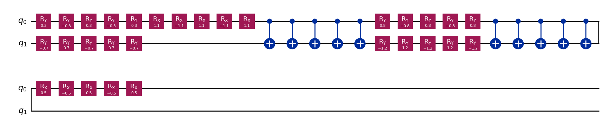

# Experimental Setup

## Overview

After introducing the theoretical foundations of Zero-Noise Extrapolation, the next step is to evaluate its effectiveness in practice.

The objective of this project is not only to implement ZNE, but also to understand how well it performs under different noise conditions. To achieve this goal, a controlled experimental environment was constructed using quantum circuit simulation.

The experiments were designed to answer three main questions.

First, how strongly do different noise models affect the outcome of a quantum computation?

Second, can Zero-Noise Extrapolation successfully recover results that are closer to the ideal noise-free values?

Finally, does Second-Order Richardson Extrapolation provide a measurable improvement over the simpler First-Order approach?

To answer these questions, a series of experiments were conducted using Qiskit and Qiskit Aer simulators, allowing complete control over the quantum circuit, the noise model, and the mitigation strategy.

---

# Software Environment

The implementation was developed using:

- Python
- Qiskit
- Qiskit Aer
- NumPy
- Matplotlib

Qiskit Aer was used to simulate noisy quantum circuits and generate density matrices for evaluating expectation values and state fidelity.

---

## Quantum Circuit

Selecting an appropriate quantum circuit is an important part of any error mitigation study. If the circuit is too simple, the impact of noise may be difficult to observe. On the other hand, if the circuit becomes excessively large, the analysis becomes more complicated and computationally expensive.

For this reason, a two-qubit variational quantum circuit was designed for the experiments.

The circuit contains parameterized RX and RY rotation gates together with CNOT gates that create correlations between the two qubits. This combination provides a useful balance between simplicity and complexity. The circuit is small enough to be simulated efficiently while still exhibiting non-trivial quantum behavior.

The use of rotation gates allows the preparation of a wide variety of quantum states, while the CNOT gates introduce entanglement and make the circuit more sensitive to noise. Because the objective of this project is to study how noise affects quantum computations, it is important that the circuit contains both single-qubit and two-qubit operations.

As noise accumulates throughout the execution of the circuit, changes in the measured expectation values can be directly observed and analyzed using Zero-Noise Extrapolation.

The circuit structure is illustrated below:

```python
qc.ry(theta[0], 0)
qc.ry(theta[2], 1)

qc.rx(theta[1], 0)

qc.cx(0,1)

qc.ry(theta[3], 0)
qc.ry(theta[4], 1)

qc.cx(0,1)

qc.rx(theta[5], 0)
```

## Why Use Density Matrices?

In an ideal quantum simulation, the state of a quantum system can often be represented using a state vector. However, once noise is introduced, the situation becomes more complicated.

Noise causes the quantum system to interact with its environment, leading to a loss of information and the creation of mixed states. Such states can no longer be described accurately using a single state vector.

To properly model noisy quantum computations, this project uses density matrices instead of pure state vectors.

Density matrices provide a more general mathematical framework that can represent both pure quantum states and mixed quantum states. This makes them particularly suitable for studying realistic noisy quantum systems.

For this reason, all noisy simulations in this project were executed using the density matrix simulator available in Qiskit Aer.


## Variational Quantum Circuit

The following variational quantum circuit was used throughout the experiments.


Figure 1: The variational quantum circuit used in the experiments.

---
# Noise Models

Three different noise models were investigated:

## 1. Depolarizing Noise

Depolarizing errors were applied to:

- RX gates
- RY gates
- CNOT gates

Both one-qubit and two-qubit depolarizing channels were considered.

---

## 2. Bit-Flip Noise

Bit-flip errors were simulated using Pauli-X channels.

The noise model randomly flips qubit states with probability p.

---

## 3. Phase-Flip Noise

Phase-flip errors were simulated using Pauli-Z channels.

This model modifies the phase of the quantum state without changing the computational basis measurement outcome.

---

# Noise Strength

The experiments were performed using multiple noise probabilities.

Typical values included:

- p = 0.001
- p = 0.005
- p = 0.01
- p = 0.02

Additional experiments were conducted at larger noise levels to evaluate the behavior of the extrapolation process.

---

## Fidelity Evaluation

Before applying error mitigation techniques, it is useful to quantify how strongly noise affects the quantum state itself.

To achieve this, state fidelity was computed between the ideal quantum state and the noisy quantum state generated by simulation.

Fidelity can be interpreted as a measure of similarity between two quantum states. A fidelity value close to one indicates that the noisy state remains very similar to the ideal state, whereas lower fidelity values indicate stronger degradation caused by noise.

Although the primary goal of this project is to recover accurate expectation values, fidelity provides an important preliminary indicator of how severely each noise model disturbs the underlying quantum state.


---


## Expectation Value Measurement

While fidelity provides information about the similarity between quantum states, Zero-Noise Extrapolation is ultimately concerned with recovering accurate observable quantities.

For this reason, the experiments focus on measuring the expectation value of the observable Z ⊗ Z.

This observable measures the correlation between the two qubits and is particularly suitable for circuits containing entangling operations such as CNOT gates.

The choice of Z ⊗ Z is important because it captures information about the collective behavior of the two-qubit system rather than the state of an individual qubit.

Expectation values were computed from the density matrix generated by the noisy simulation. By comparing the expectation values obtained before and after mitigation, it becomes possible to directly evaluate the effectiveness of Zero-Noise Extrapolation.

The observable used throughout the experiments is

$$
ZZ = Z \otimes Z
$$

and the corresponding expectation value is computed as

$$
E = Tr(\rho ZZ)
$$

where $\rho$ denotes the density matrix of the noisy quantum state.
Expectation values were computed from the density matrix obtained from noisy simulations.

---

# Noise Scaling Factors

To perform Zero-Noise Extrapolation, the following scale factors were used:

- s = 1
- s = 3
- s = 5

The original circuit corresponds to:

s = 1

while larger scale factors were generated using circuit folding.

---

# Circuit Folding Strategy

Noise amplification was achieved through global circuit folding.

For each gate G:

G → GG†G

This operation preserves the logical functionality of the circuit while increasing its effective noise level.

Higher scaling factors introduce additional folded gate sequences and therefore accumulate more noise.

---


Figure 2: Example of circuit folding used to amplify noise while preserving the logical computation.
# Richardson Extrapolation

Two extrapolation strategies were evaluated:

## First-Order Richardson Extrapolation

Uses measurements obtained from:

- s = 1
- s = 3

to estimate the zero-noise expectation value.

---

## Second-Order Richardson Extrapolation

Uses measurements obtained from:

- s = 1
- s = 3
- s = 5

to remove additional error terms and improve estimation accuracy.

The performance of both approaches was compared across all investigated noise models.
