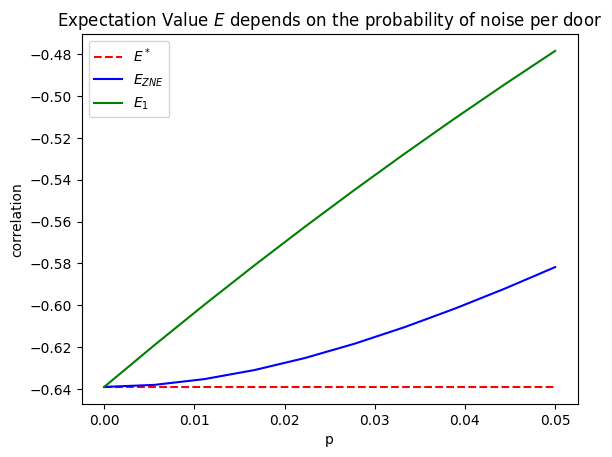
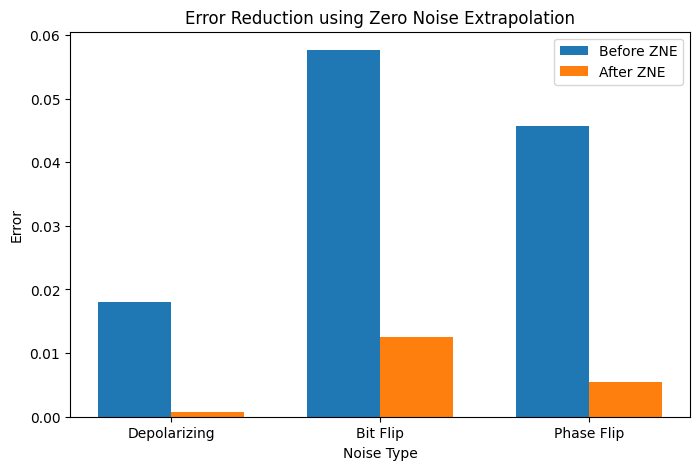

# Results and Discussion

## Overview

This section presents the experimental results obtained from applying Zero-Noise Extrapolation (ZNE) to a variational quantum circuit under different quantum noise models.

The effectiveness of both First-Order and Second-Order Richardson Extrapolation is evaluated and compared.

---

# Fidelity Analysis

Before applying error mitigation, the impact of each noise model was evaluated using state fidelity.

The following results were obtained for a noise probability of p = 0.01:

| Noise Model | Fidelity |
|------------|-----------|
| Depolarizing Noise | 0.9528 |
| Bit-Flip Noise | 0.9254 |
| Phase-Flip Noise | 0.9303 |

These results indicate that all investigated noise channels degrade the quantum state, with bit-flip noise producing the largest reduction in fidelity.

---

# Depolarizing Noise Results

For depolarizing noise, Zero-Noise Extrapolation successfully reduced the estimation error.

### Example Results

| Method | Error |
|----------|----------|
| No ZNE | 0.01796 |
| First-Order Richardson | 0.00079 |

The results demonstrate that Richardson extrapolation can significantly improve the accuracy of expectation value estimation.

Figure 4: Comparison between the noisy expectation value and the mitigated expectation value obtained using Zero-Noise Extrapolation.

---

# Bit-Flip Noise Results

For bit-flip noise, both first-order and second-order Richardson extrapolation improved the results.

| Method | Error |
|----------|----------|
| No ZNE | 0.05764 |
| First-Order Richardson | 0.01247 |
| Second-Order Richardson | 0.00655 |

The second-order approach reduced the error by approximately nine times compared to the original noisy result.

---

# Phase-Flip Noise Results

Phase-flip noise showed the largest benefit from higher-order extrapolation.

| Method | Error |
|----------|----------|
| No ZNE | 0.04570 |
| First-Order Richardson | 0.00541 |
| Second-Order Richardson | 0.00085 |

The error reduction achieved by second-order Richardson extrapolation was significantly greater than that obtained using the first-order method.

---

# First-Order vs Second-Order Richardson Extrapolation

To compare the two extrapolation methods, the mitigation error obtained under each noise model was analyzed.

| Noise Model | No ZNE | First Order | Second Order |
|------------|------------|------------|------------|
| Bit Flip | 0.05764 | 0.01247 | 0.00655 |
| Phase Flip | 0.04570 | 0.00541 | 0.00085 |

In all investigated cases, Second-Order Richardson Extrapolation produced lower errors than First-Order Richardson Extrapolation.

Figure 5: Error reduction achieved by Zero-Noise Extrapolation across different noise models.

---

# Discussion

Several important observations can be drawn from the experiments:

### Observation 1

Noise significantly affects the accuracy of quantum computations even for relatively small circuits.

---

### Observation 2

Zero-Noise Extrapolation consistently improved the estimation accuracy under all investigated noise models.

---

### Observation 3

Second-Order Richardson Extrapolation outperformed First-Order Richardson Extrapolation in every tested scenario.

---

### Observation 4

Phase-flip noise benefited most from higher-order extrapolation, suggesting that structured noise channels may be particularly suitable for advanced ZNE techniques.

---

# Key Takeaways

The experiments demonstrate that:

- Zero-Noise Extrapolation is an effective Quantum Error Mitigation technique.
- Circuit folding successfully amplifies noise while preserving circuit functionality.
- Richardson Extrapolation can recover expectation values closer to the ideal result.
- Higher-order extrapolation provides substantial improvements over standard first-order approaches.

These findings support the use of ZNE as a practical mitigation strategy for current NISQ quantum devices.
