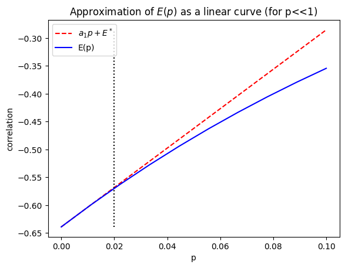

# Zero-Noise Extrapolation (ZNE)

## What is Zero-Noise Extrapolation?

Zero-Noise Extrapolation (ZNE) is one of the most widely used Quantum Error Mitigation techniques for Noisy Intermediate-Scale Quantum (NISQ) devices.

The main objective of ZNE is to estimate the result that would have been obtained from an ideal noise-free quantum computer without requiring Quantum Error Correction.

Instead of removing noise directly, ZNE follows a different strategy:

1. Execute the same quantum circuit under multiple noise levels.
2. Measure the corresponding expectation values.
3. Extrapolate these measurements back to the zero-noise limit.

This process provides an estimate of the ideal expectation value while using the same noisy hardware.

---

# Why Does ZNE Work?

Assume that a measured expectation value depends on the noise strength p:

E(p)

For sufficiently small noise levels, the expectation value can be approximated using a Taylor expansion:

$$
E(p)=E^{*}+a_1p+a_2p^2+a_3p^3+\cdots
$$

where:

- $E^{*}$ is the ideal noise-free value.
- $p$ is the noise strength.
- $a_i$ are unknown coefficients.
  

Figure 3: Linear approximation of the expectation value E(p) for small noise levels.

---

# Noise Scaling

To perform extrapolation, we need measurements at different noise levels.

On real quantum hardware, directly changing the physical noise level is often impossible.

Instead, ZNE artificially increases the effective noise by modifying the quantum circuit while preserving its logical behavior.

This process is called **Noise Scaling**.

---

# Circuit Folding

In this project, noise scaling is achieved using **Circuit Folding**.

A quantum gate G can be replaced by:

G → GG†G

where:

- G† is the inverse of G.
- The overall operation remains equivalent to G.

Since additional gates are executed, more noise accumulates in the circuit even though the ideal computation remains unchanged.

For larger scaling factors:

Scale = 1

Original circuit

Scale = 3

GG†G

Scale = 5

GG†GG†G

As the scaling factor increases, the circuit experiences a higher effective noise level.

---

# Richardson Extrapolation

After collecting expectation values at different noise scales, we can estimate the zero-noise result using Richardson Extrapolation.
The expectation value of an observable $O$ is

$$
E = \langle O \rangle
$$

In this project, the observable used is

$$
O = Z \otimes Z
$$

which measures the correlation between the two qubits.
This technique combines measurements obtained from multiple noise levels to cancel the dominant noise contributions.

---

# First-Order Richardson Extrapolation

Using measurements obtained at scaling factors 1 and 3:

$$
E_1 = E(s=1)
$$

$$
E_3 = E(s=3)
$$

The first-order Richardson estimate is

$$E_{ZNE}^{(1)}=\frac{3E_1-E_3}{2}$$

---

# Second-Order Richardson Extrapolation

Using measurements obtained at scaling factors

$$
s = 1,\;3,\;5
$$

the second-order Richardson estimate becomes

$$E_{ZNE}^{(2)}=\frac{15E_1-10E_3+3E_5}{8}$$

Second-order extrapolation removes additional error terms and generally produces a more accurate estimate of the ideal expectation value.

However, it may also become more sensitive to statistical fluctuations.

---

# Implementation in This Project

The following scaling factors were used:

- Scale 1
- Scale 3
- Scale 5

For each scale:

1. The circuit was folded.
2. Noise was applied using Qiskit Aer.
3. The expectation value was measured.
4. Richardson extrapolation was performed.

Both First-Order and Second-Order Richardson methods were evaluated and compared.

---

# Expected Benefits

Zero-Noise Extrapolation offers several advantages:

- No additional qubits are required.
- Compatible with current NISQ devices.
- Simple to implement in simulation and hardware.
- Can significantly improve computational accuracy.

These properties make ZNE one of the most practical Quantum Error Mitigation techniques available today.
